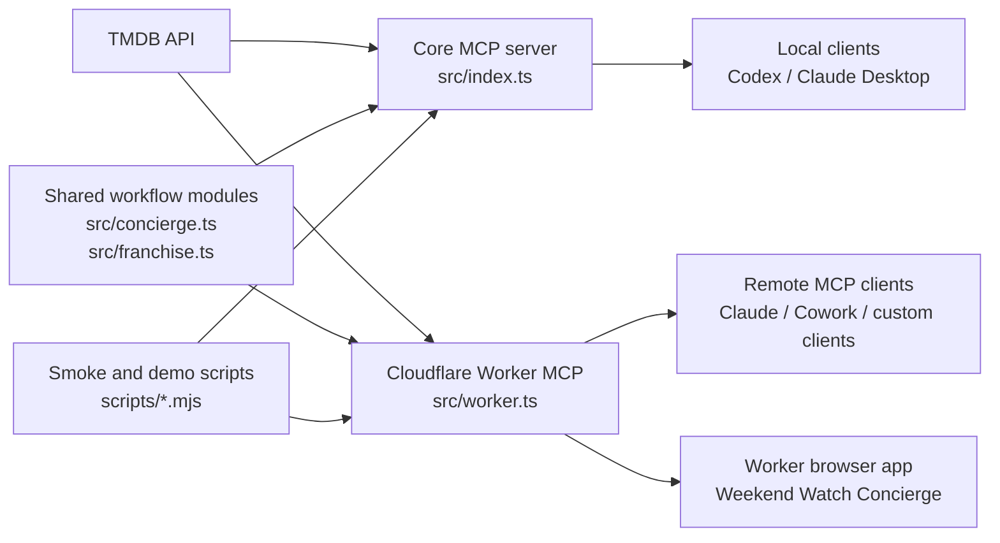

# TMDB MCP User Guide

This repo has two related but separate goals:

1. **Reusable MCP server**: an independent TMDB-powered MCP server that any compatible client can use.
2. **Feature workflows**: higher-level movie and TV workflows built on top of that server.

The distinction matters. The MCP server should stay broadly useful and stable. Feature workflows should be added only when they represent a durable user intent, not every TMDB endpoint.

## Architecture



## What Belongs Where

### MCP server surface

Expose a feature as an MCP tool when it is something a user or agent would ask for directly:

- `get_weekend_watchlist`: "Find me something to watch this weekend."
- `plan_watch_party`: "Pick a movie for a group."
- `build_franchise_watch_order`: "What order should I watch this franchise?"
- `recommend_from_taste_profile`: "Recommend something based on what I like and dislike."
- `compare_movies`: "Help me choose between these movies."
- `find_where_to_watch`: "Where can I watch these titles?"

These tools combine multiple TMDB calls and return a decision-ready answer.

### Shared modules

Put reusable logic in TypeScript modules when it is internal machinery:

- ranking
- scoring
- provider matching
- title normalization
- franchise resolution
- formatting and summaries

Current examples:

- `src/concierge.ts`: weekend and watch-party planning logic
- `src/franchise.ts`: franchise watch-order logic

### Scripts and demos

Keep something as a script when it is mainly for verification, a demo story, or an artifact:

- `scripts/tool-surface-smoke.mjs`: validates the MCP tool contract
- `scripts/now-playing-follow-on-demo.mjs`: produces an example workflow artifact
- `scripts/weekly-trending-languages.mjs`: shareable language-trend demo

Scripts can chain existing tools without creating a new public MCP tool.

## Tool-Bloat Rule

Do not add a new MCP tool just because TMDB has an endpoint for it.

Add a tool only when it satisfies most of these criteria:

- A user can describe the need in one natural sentence.
- The output helps make a decision, not just inspect raw data.
- It combines multiple TMDB calls or adds useful ranking/filtering.
- The input schema is stable and simple.
- It works for local stdio MCP and the Cloudflare Worker MCP.
- It can be covered by `npm run smoke:tools`.

If a feature fails those checks, keep it as shared code or a script until it proves durable.

## Current Workflow Tools

| Tool | User intent | Best for |
| --- | --- | --- |
| `get_weekend_watchlist` | Find a ranked shortlist for tonight or the weekend | Solo or simple household viewing |
| `plan_watch_party` | Pick for a group with mixed moods and constraints | Group watch decisions |
| `build_franchise_watch_order` | Decide how to watch a franchise or universe | Multi-movie watch planning |
| `recommend_from_taste_profile` | Recommend from liked and disliked titles | Personalized discovery |
| `compare_movies` | Choose between known movie IDs | Side-by-side tradeoffs |
| `find_where_to_watch` | Check availability for one or more titles | Actionable provider lookup |

## Feature Pipeline

Recommended next features, in order:

1. **Actor / Director Watch Path**
   - Tool: `build_person_watch_path`
   - Inputs: person name, country, services, max titles
   - Output: starter pick, best-rated pick, recent pick, hidden gem, and available-now pick
   - Why: it turns existing person search/details into a decision workflow.

2. **Weekly Streaming Radar**
   - Tool or script first: start as `scripts/weekly-streaming-radar.mjs`
   - Output: Markdown brief with trending titles, provider-aware picks, language groups, and skip notes
   - Why: useful recurring artifact, but it should prove itself as a script before becoming an MCP tool.

3. **Family-Safe Filtered Picks**
   - Tool: likely an extension to `get_weekend_watchlist` or `plan_watch_party`, not a new tool
   - Inputs: age range, max rating level, runtime, country, services
   - Why: valuable, but probably belongs inside existing watchlist/planner workflows to avoid tool bloat.

4. **Release Calendar Watchlist**
   - Tool or script: start as a script
   - Output: upcoming releases by country/language/genre with "watch later" notes
   - Why: useful, but more time-sensitive and less decision-complete than the top two.

## Verification Checklist

After adding or changing tools:

```bash
npm run build
npm test
set -a && source ./.env && set +a && npm run smoke:tools
WRANGLER_LOG_PATH=/tmp/wrangler-tmdb.log npm run worker:dry-run
TMDB_API_KEY=dummy node plugins/tmdb/scripts/smoke-test.mjs
```

For Worker-visible UI changes, also run the local Worker and inspect the browser app:

```bash
set -a && source ./.env && set +a && WRANGLER_LOG_PATH=/tmp/wrangler-tmdb-dev.log npm run worker:dev
```

Then open:

```text
http://127.0.0.1:8787/
```

If the change is intended for regular users, merge it to `main` and redeploy the Worker. A GitHub merge alone does not update the deployed Cloudflare Worker.
